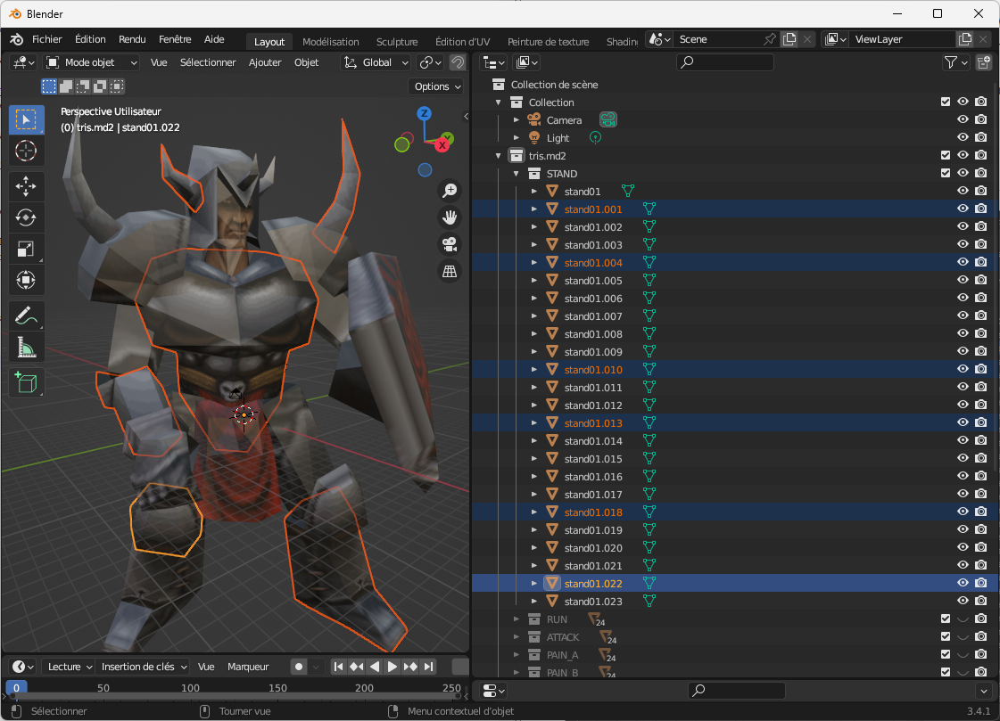

# Blender MD2 Import plugin

this Python script add an Import option to Blender to load a Quake MD2 File

it's my first Python script, and I'm a Blender newbie :)

it was build from [another plugin](https://github.com/lennart-g/blender-md2-importer) that reports some strange errors about 'PIL' and my experience on MD2 file under Embarcadero Delphi.

the script is very sloooowww, so be patient :)

once the MD2 is imported you'll see all the frames, but each animation is in it's own collection, so you can hide all but one.

you have to load the texture in the ready to use predefined material.

the MD2 model is imported with a mesh for each connected vertices; for instance, the chest of the knight is a mesh on its own...but the number of meshes depends on the design of the model.
  
I don't think that the predefined MD2 normal vectors are correctly imported.

And I don't know if it's possible to setup the animation player with the right number of frames according to the selected collection.

